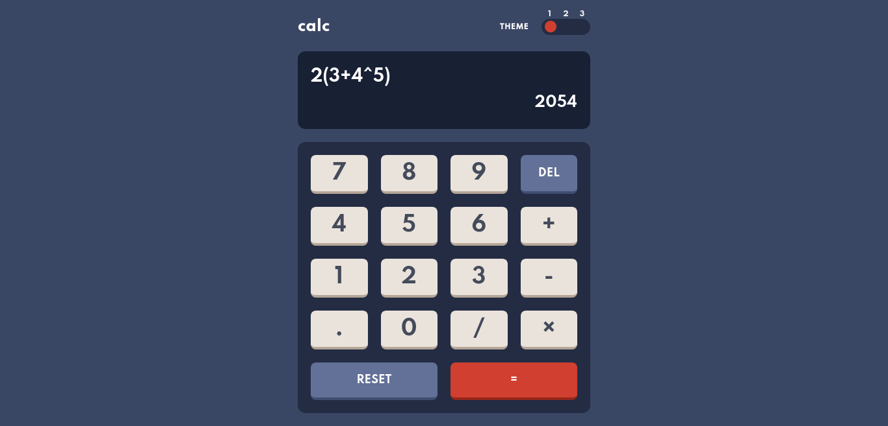

# Calc app

This is a scientific calclulator built with [React](https://reactjs.org/) as a solution to the calculator app challenge on [Frontend Mentor](https://www.frontendmentor.io/challenges/calculator-app-9lteq5N29). it can run on native devices as a PWA and on the web.

### Screenshot


### Links

- Solution URL: [frontendmentor.io](https://f)
- Live Site URL: [hyocalc](https://hyocalc.netlify.app/)


### Built with

- [React](https://reactjs.org/) - JS library
- [hyoka](https://github.com/olamide203/hyoka) - Math library
- SCSS
- CSS Grid
- Mobile-first workflow

## Installation
this project uses [pnpm]() as a package manager. to install it, run the following command:
```bash
npm install -g pnpm
```
clone the repository:
```bash
  git clone git@github.com:olamide203/calc-app.git
```
cd into the project directory and install the dependencies:
```bash
  cd calc-app
  pnpm install
  pnpm run start
```

## License
[MIT](https://choosealicense.com/licenses/mit/)